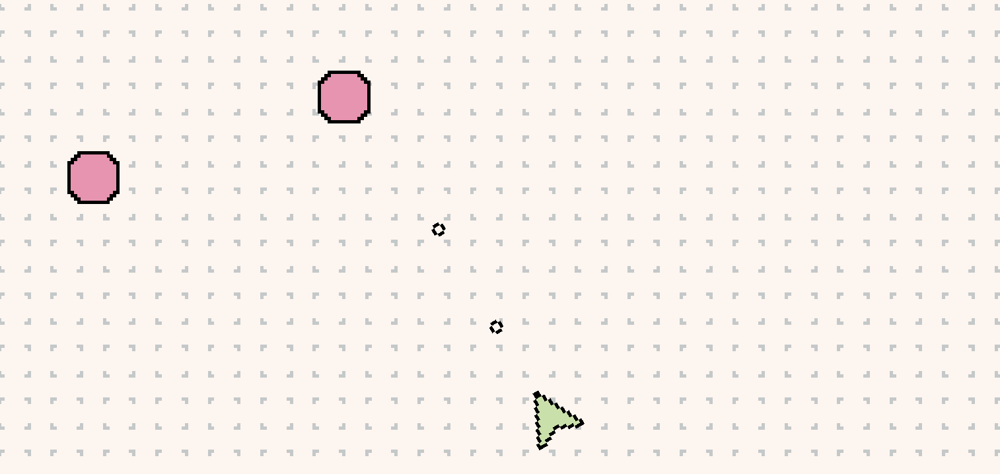

    

# Square Invasion 2D Unity

## Sobre el juego

Es un juego tipo "mata-marcianos" con vista desde arriba en 2D. Sobrevive al ataque de los cuadrados que no dejarán de aparecer  hasta que te maten o te choques contra los bordes del mapa.

Sistema de movimiento basado físicas 2D.

Spawner de enemigos.

Configuración de capas.

## Controles

Controles simples para el jugador: moverse (W), rotar (A y D) y disparar (Espacio).

## Requisitos previos

- Necesario tener instalado Unity HUB. 
- La versión de Unity utilizada para el desarrollo es  **2021.3.18f1**.
- Tener entorno de desarrollo como Visual Studio o Visual Studio Code.

## Instalación 

Descargar/Clonar el proyecto en el equipo local y agregarlo como proyecto en Unity HUB.

## Programas utilizados

- Unity 3D
- Visual Studio Code
- Aseprite

## Licencia

Este es software libre y sin compromiso publicado en el dominio público.

Cualquier persona es libre de copiar, modificar, publicar, usar, compilar, vender o
distribuir este software, ya sea en forma de código fuente o como binario,
para cualquier propósito, comercial o no comercial, y por cualquier
medio.

En las jurisdicciones que reconocen las leyes de derechos de autor, el autor o autores
de este software dedican cualquier y todos los derechos de autor del
software para el dominio público. Hacemos esta dedicación para el beneficio
del público en general y en detrimento de nuestros herederos y
sucesores. Pretendemos que esta dedicación sea un acto manifiesto de
renuncia a perpetuidad de todos los derechos presentes y futuros de esta
software bajo la ley de derechos de autor.

EL SOFTWARE SE PROPORCIONA "TAL CUAL", SIN GARANTÍA DE NINGÚN TIPO,
EXPRESA O IMPLÍCITA, INCLUYENDO PERO NO LIMITADA A LAS GARANTÍAS DE
COMERCIABILIDAD, APTITUD PARA UN PROPÓSITO PARTICULAR Y NO INCUMPLIMIENTO.
EN NINGÚN CASO, LOS AUTORES SERÁN RESPONSABLES POR CUALQUIER RECLAMACIÓN, DAÑOS O
OTRA RESPONSABILIDAD, YA SEA EN UNA ACCIÓN DE CONTRATO, TORT U OTRA MANERA,
DERIVADO DE, FUERA DE O EN RELACIÓN CON EL SOFTWARE O EL USO O
OTRAS REPARACIONES EN EL SOFTWARE.

Para más información, consulte <http://unlicense.org/>